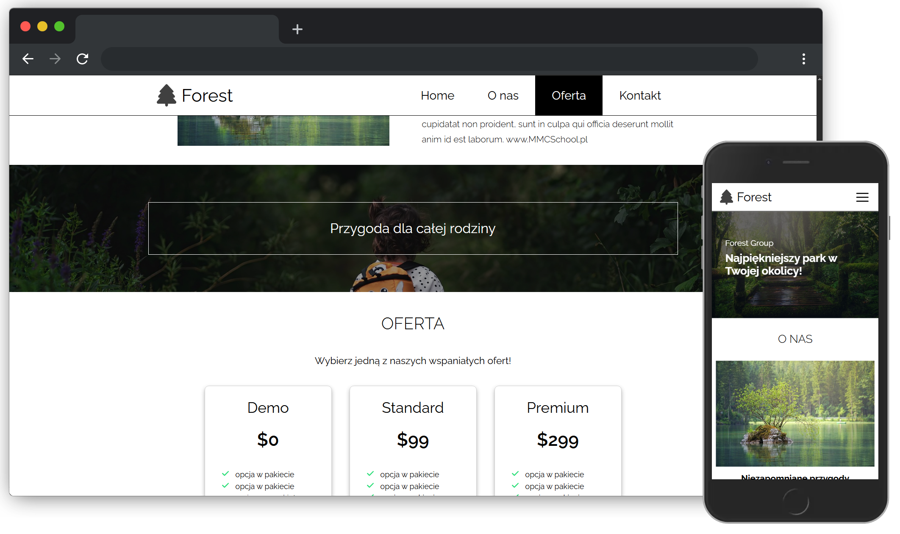

# 🌲 Forest Group website

The final assignment of the Frontend Developer course at [MMC School](https://lw.mmcschool.pl/course/kurs-tworzenia-stron-www-cz-4). The goal was to build a fully responsive website using semantic HTML, modular SCSS, and vanilla JavaScript based on prepared mock-up. 

## 📷 Preview

## Table of contents

- [Features](#features)
- [Technologies Used](#technologies-used)
- [JavaScript Features](#javascript-features)
- [Live](#live)
- [Credits](#credits)

## ✨ Features

- Responsive design (works well on mobile, tablet, and desktop)
- Sticky navigation bar with burger menu for mobile
- SVG sprite system for icons
- Hover effects on buttons and navigation
- Contact page with working navigation back to main site

## 🛠 Technologies used

- **HTML5** - semantic structure with BEM metodology
- **SCSS** - modular CSS with variables, partials and imports  
- **JavaScript (ES6+)** - interactivity (mobile menu and current date in footer)  
- **Flexbox** - layout building  
- **Responsive Web Design (RWD)** - works on desktop, tablet, and mobile  
- **SVG sprite** - optimized icon usage  

## 🧠 JavaScript Features

- `event listeners` for hamburger menu
- `new Date` for automatic date updating
- `onscroll` for scrollspy (highlights menu items while scrolling on desktop)

## 💻 Live

Here is a working [live demo](https://takatamasu.github.io/forest-group-website/). To view the project locally, clone the repo and open `index.html` in your browser

## 📚 Credits and assets

[Mockup (PDF)](./design/forest-group-mock-up.pdf) made by [MMC School](https://lw.mmcschool.pl/course/kurs-tworzenia-stron-www-cz-4)

#### Graphics

- Jungle image: [Pixabay](https://pixabay.com/photos/jungle-pathway-steps-way-sunlight-1807476/) by [sasint](https://pixabay.com/users/sasint-3639875/)
- Waters image: [Pixabay](https://pixabay.com/photos/waters-nature-lake-river-water-3095682/) by [jplenio](https://pixabay.com/users/jplenio-7645255/)
- Girl image: [Pixabay](https://pixabay.com/photos/little-girl-walking-forest-path-5785590/) by [JonPauling](https://pixabay.com/users/jonpauling-19157087/)

#### Icons

- Free icons: [iconfinder](https://www.iconfinder.com/)

#### Fonts

- Raleway font: [Google Fonts](https://fonts.google.com/)
